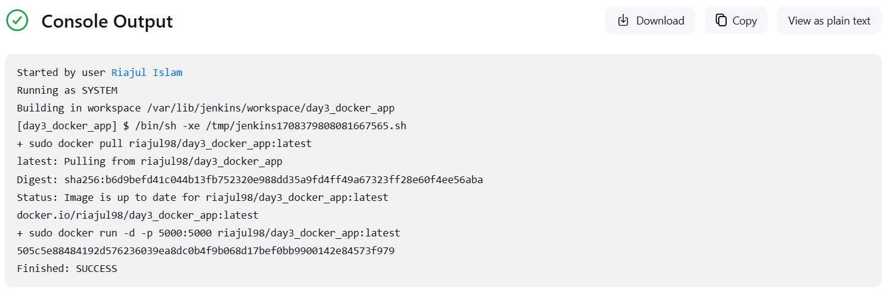
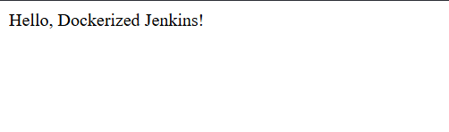

# Day 3 Project: Dockerize a Simple Application and Run it on Jenkins
Objective: Today's project involves creating a Docker container for a simple application, pushing it to Docker Hub, and then setting up Jenkins to pull and run this container. This demonstrates automating Docker workflows with Jenkins.

## Project Requirements:
- Amazon Linux: Use your Amazon Linux environment to set up and test the application.
- Docker: Create a Dockerfile for a simple application and push the image to Docker Hub.
- Jenkins: Configure Jenkins to pull the Docker image and run it in a container.

## Steps to Implement:
Step 1: Create a Simple Application and Dockerfile
Create a directory for the project:

```
mkdir ~/day3_docker_app && cd ~/day3_docker_app
```

Write a Simple Python Application: Create a app.py file with a simple Flask web server:

```
from flask import Flask
app = Flask(__name__)

@app.route("/")
def hello():
    return "Hello, Dockerized Jenkins!"

if __name__ == "__main__":
    app.run(host="0.0.0.0", port=5000)

```

Write a Dockerfile: Create a Dockerfile to containerize the application:

```
FROM python:3.8-slim

WORKDIR /app
COPY app.py /app
RUN pip install flask

CMD ["python", "app.py"]
```

Step 2: Build and Push Docker Image to Docker Hub
Login to Docker Hub:

```
docker login
```
Build the Docker Image:

```
docker build -t <your_dockerhub_username>/day3_docker_app:latest .
```

Push the Image to Docker Hub:

```
docker push <your_dockerhub_username>/day3_docker_app:latest
```
Step 3: Set Up Jenkins Job to Pull and Run Docker Image
In Jenkins, create a new Freestyle project called DockerizedApp.
Add Build Steps:
In the Build section, add a Build Step that executes a shell command to pull and run the Docker container.
Use the following commands in the build step:
```
docker pull <your_dockerhub_username>/day3_docker_app:latest
docker run -d -p 5000:5000 <your_dockerhub_username>/day3_docker_app:latest
```

You should get the below output;

Test the Job:
Save the job, click Build Now in Jenkins, and navigate to http://<your-server-ip>:5000 to verify the application is running.

You should see the below;


